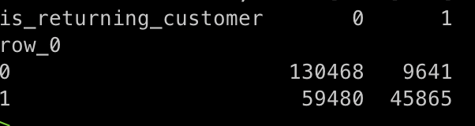

# Technical task for the _Data Scientist_ role at the Marketing Tech dept., Delivery Hero SE  
  
The exercise is based on a simplified version of a real model built by our team. *Its objective* is, to predict whether a customer is going to return (order again from us) in *the upcoming 6 months* or not.  
So the main idea is, *to create an algorithm to correctly predict the **_is_returning_customer_*** label (see details [here](#Labeled-data)) based on the [provided data](#Data-dictionary).  
  
You can solve this exercise using the Python data ecosystem with the usual well-known tools and libraries.  
  
## Data dictionary  
  
There are [two data samples](./data/) provided as (gunzipped) CSV files.  
  
### Order data  
  
The [order dataset](./data/machine_learning_challenge_order_data.csv.gz) contains the history of orders placed by customers acquired between 2015-03-01 and 2017-02-28. The data points were *synthetically* generated to reflect patterns of real data for the purpose of the exercise.  
  
The dataset columns definition:  
  
|Column|Description|  
|---|---|  
|*customer_id*|Unique customer ID.|  
|*order_date*|Local date of the order.|  
|*order_hour*|Local hour of the order.|  
|*customer_order_rank*|Number of a successful order counted in chronological order starting with 1 (an empty value would correspond to a failed order).|  
|*is_failed*|**0** if the order succeeded.<br>**1** if the order failed.|  
|*voucher_amount*|The discounted amount if a voucher (discount) was used at order's checkout.|  
|*delivery_fee*|Fee charged for the delivery of the order (if applicable).|  
|*amount_paid*|Total amount paid by the customer (the *voucher_amount* is already deducted and the *delivery_fee* is already added).|  
|*restaurant_id*|Unique restaurant ID.|  
|*city_id*|Unique city ID.|  
|*payment_id*|Identifies the payment method the customer has chosen (such as cash, credit card, PayPal, ...).|  
|*platform_id*|Identifies the platform the customer used to place the order (web, mobile app, mobile web, …).|  
|*transmission_id*|Identifies the method used to place the order to the restaurant (fax, email, phone, and different kinds of proprietary devices or point-of-sale systems).|  
  
The data rows are ordered by *customer_id* and *order_date*: all orders of one customer appear in chronological order on consecutive rows.  
  
It is not necessary to know the exact meaning of the IDs, therefore we do not provide the mapping from the IDs to actual restaurants / cities / payment methods / platforms / transmission methods.  
  
### Labeled data  
  
The [labeled dataset](./data/machine_learning_challenge_labeled_data.csv.gz) flags whether the customers placed at least one order within 6 months after 2017-02-28 or not.  
  
The dataset columns definition:  
|Column|Description|  
|---|---|  
|*customer_id*|Unique customer ID.|  
|*is_returning_customer*|**0** if the customer did not return (did not order again) in the 6 months after 2017-02-28.<br>**1** if the customer returned (ordered again) at least once after 2017-02-28.|  
  
The data rows are ordered by *customer_id*.  
  
## Solution submission criteria  
  
Please send us back:  
  
 - All the code and files you used (both, for exploration and the final ones) as a GitHub repository (see [below](#How-to-submit-the-code) for further details)  
 - A summary of the data transformations that you tried, and the ones you kept (we should be able to see this in the commit history)  
 - A description of the ML models you tried, and the one you kept (we should be able to see this in the commit history)  
 - A measurement of how good your models are (at least for the best one)  
 - Any other findings on the data that you would like to share  
 - Ideas about any further models or data transformations that you would try if you had more time  
  
Please try to make commits as often and concise as possible to allow us to follow your working process.  
  
### How to submit the code  
  
Please clone this repo to a public Github repo that does not contain an obvious name (to avoid other candidates from copying it). Just choose a couple of random dictionary words and name your repo with them :-)  
  
The GitHub repo should contain:  
 - All the code (both for exploration and the models) and the commits history showing the process you followed  
 - The instructions on how to train and evaluate the model you would build  
  
*Please share **the full** codebase you developed while working on the task*.  
  
## How we evaluate the task  
  
Please take into account the solution quality points that we value the most:  
  
 - The solution is working, i.e. codebase can be executed by us in our environment by following your instructions  
 - The structure of the repository is clear  
 - The codebase is human-readable  
 - Python best practices are being followed, i.e. good development practices and Python principles and idioms are in place  
 - The commits are atomic  
 - Unit/integration/smoke tests are implemented  
  
Regarding the modeling task, we value:  
  
 - Clarity of the reasoning behind assumptions and modelling approach you are going to select  
 - EDA  
 - Feature engineering  
 - Algorithm(s) chosen  
 - Models predictive performance evaluation and monitoring  
  
## Final notes  
  
We value a working solution and the reasoning of choices behind the solution the most. With your solution, please try to express yourself in a way you would do, while working on a real business problem.  
  
Please do not hesitate to write us in case of further questions. We would be happy to address them as soon as possible to clarify the task.  
  
We hope that you find the exercise interesting, and it is worth your time.  
  
Good luck, and looking forward to meeting you at the next interview round!

## Solution
Similar to any datascience approach, I have performed some EDA, ETL and Model training.
### EDA

1. We check for null values in dataframe
2. Only customer rank has null values
3. Most of the time when customer rank is null the customer is returning
4. We also see that though the data is only till Feb 2017,the number of customers returning is maximun for the year 2017
5. More than 50 percent of customers in 2017 are returning
You can check the pandas profiling reports that are stored at `src/output` directory executed from `notebooks/eda.upynb`.
    - raw_data_report.html
    - null_data_report.html
    - duplicate_datareport.html
    - etl_data_report.html (larger in size, please run the code and obtain the same)
### Data cleansing and Feature Engineering
1. The orders data is summarized and we create many variables that describe the mean,min,max,median and sum of the variables
2. We create order)date_amin and order_date_amax for every customer(min and max order date)
3. We bucket the order hours and create 3 variables that describe if the orders are in day,evening or night
4. We create other variables that calulates the total of nonzerovoucher,voucher_amount,is_failed,amount_paid,delivery_fee,hour_class_day,hour_class_evening,hour_class_night
5. We careate a recenency score variable for every customer.If the customer last order date is purchased more recently then more chances he will return again


### Model
1. I have implemented Randomforest model as classifier
2. In order to overcome data imbalance I have done undersapmling of the majority class for different k cross validations and built the randomforest on different holdout datasets
3. The final model is a combination of different random forest models
4. By this way I am able to predict the number of returning customers more 

### Running the model
1. Create a python virtualenv and execute `pip install -r requirements.txt`
2. Activate the env and run, `python src/main.py`
    - NOTE: If you experience any module not found error, add the root directory to PYTHONPATH: `export PYTHONPATH=$PYTHONPATH:${pwd}`
    ```
    > python src/main.py
    2021-02-25 17:42:02,326 - [INFO] - [Delivery_Hero_ETL] : Reading csv data..
    2021-02-25 17:42:03,891 - [INFO] - [Delivery_Hero_ETL] : Adding time related additional columns
    ```

3. You should be seeing the predicted results in the `output` folder. Also, you can track the progress in the mlflow GUI.
    - NOTE: 
        I have tested the model against the whole dataset by removing duplicates and saved the result in `output/all_pred_wholedf.csv` file.  Below, is a simple crosstab of the same.

        
### Testing
I have created some unit testing which is about ~45% coverage. But, this can be improved by adding more unit tests

### Logging
Finally, added logging to stdout for better debugging purposes.

### TODO
With the emerging use of MLflow, the models could be retrieved from disk and can be ensembled. I might need to make use of pyfunc.model wrapper exposing the estimators (right now, the default method available is predict)
